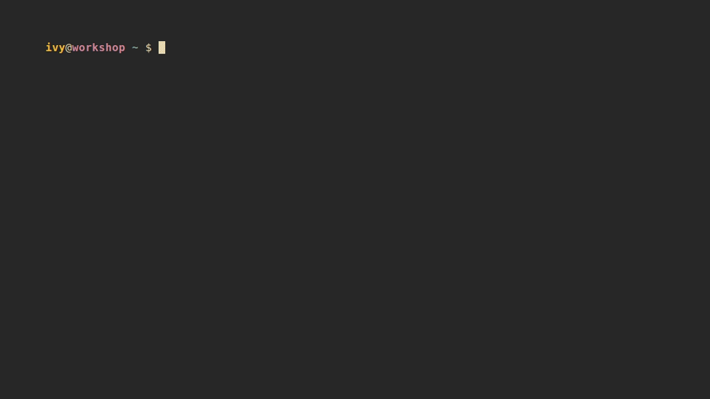

# hi.sh -> sshrc supercharged

---

## EXPERIMENTAL UNTIL v1.0.0-stable RELEASES

NOTE: Project is in active development, many things are subject to change
and this current state is not a representation of final, published quality.
This is a hobby project.

---

[Test Badge Disclaimer](docs/TESTING.md#coverage-and-profiling)

**One config directory to rule them all, uniting all shells from all hosts!**

_Don't `ssh`ush your hosts, say `hi`!_

## Contents

- [Every target, the same session](#every-target-the-same-session)
  - [ssh, with a permanent install](#ssh-with-a-permanent-install)
  - [docker](#docker)
  - [podman](#podman)
  - [nomad](#nomad)
  - [kubernetes](#kubernetes)
  - [completion, every backend at once](#completion-every-backend-at-once)
- [Requirements](#requirements)
- [Installation/Usage](#installationusage)
- [Configuration](#configuration)
  - [Hostname, username, and group/tag colors](#hostname-username-and-grouptag-colors)
- [Built from/with/in mind](#built-fromwithin-mind)
  - [Docker / Podman containers](#docker--podman-containers)
  - [Nomad allocations](#nomad-allocations)
  - [Kubernetes pods](#kubernetes-pods)
  - [Windows hosts](#windows-hosts)
- [say-hi and the alternatives](#say-hi-and-the-alternatives)
  - [Compatibility](#compatibility)
- [Testing](#testing)
- [More docs](#more-docs)
- [AI Usage](#ai-usage)

## Every target, the same session

The pitch is that `hi` behaves identically whatever is on the other end — an
ssh host, a container, an allocation, a pod — and whatever shell each side
runs. One GIF per backend, deliberately varying both sides, and each one
configured differently: the line under every GIF names the knob it is showing,
so the set reads as a configurable tool rather than one fixed look. The GIF at
the top of this README is the exception on purpose — it is the stock defaults,
with nothing turned off. A last GIF closes the section without being a backend
at all: completion, which answers with every one of them at once. How they are
rendered, and what to catch when you regenerate them, is in
[docs/PACKAGING.md](docs/PACKAGING.md#regenerating-the-demo-gifs).

### ssh, with a permanent install

The target carries its own `~/say-hi`, so nothing ships over the wire — hi
loads the tree in place and leaves it alone on exit. Client: bash.
Showing `_HI_HEADER_TIMESTAMP=0` and `_HI_HEADER_SYSINFO=0` — set on the _box_,
not the client: a permanent install reads its own config, so this is the demo
whose knob lives on the target.

### docker

A debian/bash container, then an alpine box whose only real shell is zsh —
hi probes and falls back without being told. Client: zsh.
Showing `_HI_PROMPT_END_ZSH` and `_HI_HEADER_CHECK=0` — the same debian target
as the GIF at the top, styled differently from the client side.

### podman

A fish-only alpine container from a fish client: no bash anywhere in the
loop. Same session, same code path as docker.
Showing `_HI_PROMPT_END_FISH` — fish's own prompt separator.

### nomad

A dev agent, one docker-driver job, and `hi <alloc-id-prefix>` straight into
the allocation. Client: bash.
Showing `_HI_HEADER_GHZ=1` and `_HI_HEADER_IDENTITY=0` — the CPU line in GHz,
the identity row off.

### kubernetes

A kind cluster and a bare alpine pod — busybox ash is all it has, which is
hi's aliases-only fallback. Client: zsh.
Showing `_HI_DISABLE_GIT_STATUS=1` — the same prompt, without the git segment.

### completion, every backend at once

Not a session — the roster the sessions come from. `hi <TAB>` answers with the
`Host` entries in `~/.ssh/config` _and_ every running container, allocation and
pod, each tagged with the backend it came from; `hi --<TAB>` answers hi's own
flags, without probing any backend to do it. Client: fish, for the description
column its pager gives every row.

The list stops at eleven rows because fish hands its pager half the screen, so
two ssh hosts spill into "…and 1 more row". That is completion behaving
normally, not the GIF cut short.

## Requirements

- **Client**: `bash` and `base64` (for ssh targets — armors the bootstrap
  payload through the login shell; coreutils, busybox, macOS/BSD and Git Bash
  all ship one), or `docker`/`podman`/`nomad`/`kubectl` for the
  container/alloc/pod backends.
- **bash version**: 3.2 or newer, on both ends — what macOS still ships, so hi
  stays clear of every bash-4-only construct: no `mapfile`/`readarray`
  (`_hi_read_lines` in `common/core.sh` does that job), no associative arrays,
  no namerefs, no `${x,,}`. Enforced twice: `tests/lint/shellcheck_test.sh`
  greps for those constructs, and `tests/targets/ssh_test.sh` runs a real bash
  3.2 container target to test this.
- **Target**: `base64` for ssh targets (effectively everywhere — coreutils,
  busybox, macOS/BSD); nothing extra for container/alloc/pod targets. `bash`
  gets the full experience; without it `hi` still lands you in the best shell
  the target has rather than failing outright, with a smaller session. Which
  tier you land in, and what each keeps, is [Compatibility](#compatibility).
- Everything else (client and target) is plain POSIX/bash/zsh/fish shell — no
  compiled artifacts, no package manager, no build step.

## Installation/Usage

- `say-hi/scripts/install.sh`, or `hi --install` once hi is on your `PATH` —
  the same script either way. Before touching your shell rc files it validates
  whichever of `~/.bashrc`, `~/.zshrc` and `~/.config/fish/config.fish` are
  installed, each with that shell's own syntax checker, and asks whether to
  continue if any have issues
- reload your shell!
- run `hi --configure` any time afterward to revisit the feature toggle
  prompts — header, prompt, personal settings, git status, editors, aliases,
  header details, how much of the package check to show, terminal width, and
  whether hi styles this machine too or only the hosts you say `hi` to —
  without touching the shell rc wiring. Most questions preview their answer;
  the package-check one re-renders the real check at each value you try.
  Answers land in `~/.config/say-hi/settings.sh`; see
  [Configuration](#configuration) below
- run `hi --check-configs` any time to just re-run that shell rc validation,
  without the rest of the install
- run `hi --overlay-init` to put `~/.config/say-hi` under git _in place_: from
  then on `hi --configure` commits its own writes, and a push remote is one
  `git remote add` away. Entirely optional — see
  [docs/CONFIGURATION.md](docs/CONFIGURATION.md)
- run `hi --help` (or `hi -h`) for the short version of all of this: the
  synopsis, the target resolution order, and every flag hi answers itself.
  `man hi` is the long version. Everything hi does not answer is passed to
  `ssh` unchanged
- run `hi --version` to see what is installed — the packaged version, or
  `git describe` in a checkout; the doctor and the connect header show it too
- run `hi --doctor` (or `hi --doctor <target>`, to test one host) when
  something is slow or failing: it reports the tree, the config overlay, every
  backend probed and timed with the same ceilings the header and completion
  use, and — with a target — which backend the name resolves to plus an ssh
  reachability/tooling check, all read-only
- press TAB: `hi <TAB>` completes every target — the `Host` entries in
  `~/.ssh/config` plus every running container, allocation and pod, each
  tagged with the backend it came from — and `hi --<TAB>` completes hi's own
  flags. bash, zsh and fish read the same list (`common/targets.sh`), so the
  three cannot drift; a flag word is answered without probing any backend.
  There is a GIF of both halves above:
  [completion, every backend at once](#completion-every-backend-at-once)
- configure `~/.ssh/config` tags via sshm
- [optional] pin specific colors in `~/.config/say-hi/colors` — everything else
  gets a color automatically. Copy `say-hi/misc/colors` there to start from the
  shipped defaults
  - run `hi --color-preview` to preview what every ssh host/your user resolves
    to
- [optional] copy `say-hi/misc/packages` to `~/.config/say-hi/packages` and
  edit it to your preferences
  - run `hi --packages-preview` to see what each priority means, the colors it
    renders installed and missing packages in, one real example of each from
    your own file, and the check itself as a connect will print it
- done with it? `say-hi/scripts/uninstall.sh`, or `hi --uninstall`, is the
  install's inverse: it strips hi's lines back out of your rc files, removes
  the `settings.sh` it wrote, and unlinks `/usr/bin/hi`. It leaves the `say-hi`
  directory alone, and your `colors`/`packages` too — delete those yourself if
  you want them gone

Usage: `hi foo` (just like ssh!)

## Configuration

Your config lives **outside the checkout**, in
`${XDG_CONFIG_HOME:-$HOME/.config}/say-hi/`, and rides along to every host you
say `hi` to in its own small archive — `colors`, `packages` and
`aliases.sh` overlay the tree's copies one file at a time, and `settings.sh`
(what `hi --configure` writes) has no in-tree counterpart at all. The full
picture — the overlay file table, every `_HI_DISABLE_*` feature toggle, the
header-line toggles, and every other
environment variable hi reads (`_HI_SHELL_PREFERENCE`, `_HI_PROMPT`,
`_HI_ASCII`, `_HI_HEADER_GHZ`, ...) — is in
[docs/CONFIGURATION.md](docs/CONFIGURATION.md).

**_IMPORTANT: Local-only changes MUST stay in `~/.bashrc`, `~/.zshrc`,
`~/.config/fish/config.fish`, etc. — anything in
`${XDG_CONFIG_HOME:-$HOME/.config}/say-hi/` is copied to every host you say
`hi` to._**

How a session actually gets there — what is packed, how it travels, which
shell you land in and what is left behind — is
[How it works](docs/CONFIGURATION.md#how-it-works) there too.

### Hostname, username, and group/tag colors

Every username and hostname gets a color deterministically derived from its
name. To pin a specific color instead,
add a line to `say-hi/misc/colors` (`username,root,red` /
`hostname,prod-db,yellow` / `hosttag,desktop,green`); `hosttag` entries match
the _leftmost_ tag in a `# Tags: ...` comment directly above a `Host` or
`Match host` line in `~/.ssh/config` - a wildcard block (`Host prod-*`,
`Match host prod-*`) tags every name it covers, not just one alias.
`hi --color-preview` shows what every ssh host and your user currently
resolve to, in their actual colors.

## Built from/with/in mind

- [sshrc](https://github.com/cdown/sshrc) — _from_ — (became `hi.sh`)
- [sshm](https://github.com/Gu1llaum-3/sshm) — _with_ — (optional, but _highly_
  recommended to configure `~/.ssh/config` hosttags)
- [bat](https://github.com/sharkdp/bat) — _in mind_ — (essentially my reason to
  get the aliases.sh fallthrough logic to work as portably as possible)
- [fish](https://github.com/fish-shell/fish-shell) — _with_ — (my preferred
  shell because its defaults/built-ins are extremely easy to understand, but
  one that is not POSIX-compliant)

### Docker / Podman containers

`hi <name>` also works against a running docker or podman container. If
`<name>` isn't a `Host` in `~/.ssh/config` but is a running container (by name
or ID, docker checked first), `hi` copies its tree in and chainloads
`load.sh` exactly as the ssh path does, for an identical session. No armoring
is needed (`docker exec -i`/`podman exec -i` pass stdin as raw bytes), and
cleanup happens on exit. Podman's CLI is close enough to reuse the same command
shapes. The container needs `bash` for the full experience; without it `hi`
drops you into the best plain shell `$_HI_SHELL_LADDER` finds there, with the
aliases and a warning.

### Nomad allocations

`hi <alloc-id>` also works against a running Nomad allocation (matched by
ID/prefix, after the ssh-host and container checks) — same session, same code
path as docker. Since `nomad alloc exec` has no `docker cp`/`-e` equivalent,
files stream in with `exec -i` + `cat >` and env vars go through a
`sh -c "export ...; exec ..."` wrapper. A multi-task allocation picks its task
with `hi <alloc-id>/<task>`, which becomes `nomad alloc exec -task <name>`; a
plain `hi <alloc-id>` is unchanged, and completion offers the pairs for any
allocation that has more than one task.

### Kubernetes pods

`hi <pod-name>` also works against a running Kubernetes pod (checked last,
after ssh/docker/podman/nomad) — same idea again, using `kubectl exec` with
`--` separating its own flags from the remote command. Uses whatever
context/namespace your `kubectl` is currently pointed at; a multi-container pod
picks its container the same way Nomad's tasks do — `hi <pod>/<container>`,
which becomes `kubectl exec -c <name>`. Without the suffix `kubectl` still
falls back to the pod's first container with a warning, so the suffix is how
you say which one you meant; completion offers `pod/container` for every pod
that has more than one.

### Windows hosts

`hi <target>` works against Windows OpenSSH targets too, at whatever level the
target supports:

- **WSL, Git Bash, Cygwin or MSYS2 reachable on `PATH`**: the full experience
  (header, colors, git prompt, aliases) — same code path as any other ssh host.
- **Stock Windows OpenSSH with no `bash` at all**: `hi` falls back to a plain
  interactive PowerShell session (no say-hi styling — that's bash-only) rather
  than failing outright. It still costs one authentication: hi writes its
  bootloader over the first of two calls multiplexed on the _same ssh
  connection_, and a target where that write cannot run `sh -c` is a target
  with no POSIX shell, which is exactly what the fallback is for. `DefaultShell`
  set to PowerShell lands in the same place.

**Installing hi _on_ Windows:** use WSL. The `.deb` from the releases page
installs into a WSL distribution unchanged — `/etc/profile.d/say-hi.sh`,
`/usr/bin/hi`, everything as on any Debian — and WSL is where a Windows
developer already using `ssh`/`docker`/`kubectl` most likely works.

## say-hi and the alternatives

How say-hi compares to similar tools, what the differences are, and when you
want to use something else. See [docs/ALTERNATIVES.md](docs/ALTERNATIVES.md).

### Compatibility

Two questions, because hi answers them at two different moments: **can hi land a
session on that OS at all**, and **what shell do you end up in** once it has.
Both are answered with a table, a legend and what proves each row, in
[docs/SUPPORTED.md](docs/SUPPORTED.md) — along with the targets hi reaches and
what a "yes" costs it to add one.

The other half of the same question — every OS, shell, runtime, packaging
channel and feature weighed and answered **no**, each with the argument attached
— is [docs/UNSUPPORTED.md](docs/UNSUPPORTED.md).

## Testing

`tests/test_runner.sh` (reachable as `hi --test` once installed) runs the suite
and prints a colored pass/fail summary; `--group fast` is what CI runs on every
push/PR. The runbook — all four suite groups, the parallel container cases, the
lint gate, relaying, `_HI_HOME`, and why the tests are local-only — is in
[docs/TESTING.md](docs/TESTING.md).

### Coverage and Profiling

Both coverage badges are grey because neither number can be taken at face value,
and neither gates anything: **kcov** loses its `DEBUG` trap the moment the test
harness is sourced, so it counts only what ran while things were loading and
reads far too low — `common/git_prompt.sh` shows 2.56% with seventeen cases
passing against it. **bashcov** reads bash's own `xtrace` instead and gets that
same file right at 92.68%, but it counts every line of a _heredoc body_ as
covered, so `hi.sh` — which builds the entire remote script out of heredocs —
reads far too high, reporting 100% for two connect functions the fast suites
never call.

## More docs

- [docs/CONFIGURATION.md](docs/CONFIGURATION.md) — the config overlay, every
  feature toggle and environment variable hi reads
- [docs/SUPPORTED.md](docs/SUPPORTED.md) — every target hi answers to, which
  target OSes land a full session, and which shell you end up in
- [docs/UNSUPPORTED.md](docs/UNSUPPORTED.md) — every runtime, shell, packaging
  channel and feature answered **no**, and the argument for each answer
- [docs/ALTERNATIVES.md](docs/ALTERNATIVES.md) — sshrc, xxh, kyrat, sshdot and
  homeshick side by side; what makes say-hi different, and when another tool is
  the better choice
- [docs/TESTING.md](docs/TESTING.md) — the test runner, suite groups, parallel
  cases, the lint gate, relaying
- [docs/GLOSSARY.md](docs/GLOSSARY.md) — the named idioms the code's
  `GLOSSARY:` comment tags point at; load-bearing for reading `common/`, and
  drift-checked by the lint suite
- [docs/SECURITY.md](docs/SECURITY.md) — reporting, and what hi touches on a
  target
- [docs/PACKAGING.md](docs/PACKAGING.md) — the publishing runbook: cutting a
  release, the per-channel steps, the channels weighed and not shipped, the
  reproducibility contract, how to verify a release you downloaded, and how the
  demo GIFs are regenerated
- [docs/ROADMAP.md](docs/ROADMAP.md) — what is planned, what each item is
  blocked on, and the one-time setup the release channels wait on
- [docs/CONTRIBUTING.md](docs/CONTRIBUTING.md) — the gate to run before a pull
  request, the constraints a review will bounce on, and which doc changes with
  what

## AI Usage

Heavily inspired by:
[Dictionarry/Profilarr's AI Transparency Statement](https://v2.dictionarry.dev/ai-transparency)

This started as code written entirely by
[me](https://github.com/ivylikethevine), but I have used generative AI to write
large parts of it. All of the code here is my _responsibility_ regardless: AI
is a tool, not an owner of a project. I have personally understood, reviewed
and approved all of the AI-generated code in this repository, and _mainline
releases_ carry the same accountability to me as anything I write and publish
myself.
